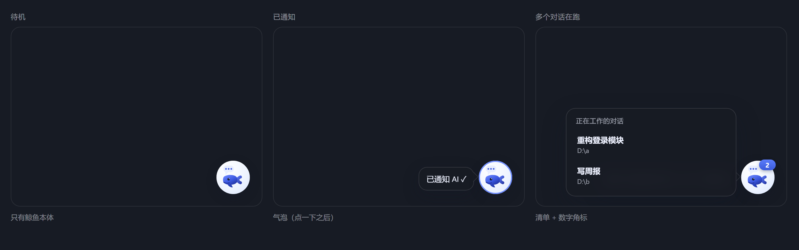

# 补充提示挂件 · Supplement Widget

> 🐋 **Whisper to your running AI.** 给正在干活的 AI 递一句悄悄话——点一下挂件，AI 停下来问你「有什么要补充的吗？」，不打断、不等候。

> 🐋 **Whisper to your running AI.** Slip an extra instruction to an agent that is already working — one click and the AI pauses to ask "anything to add?", without interrupting the run and without making you wait for it to finish.

[](#四个宿主--four-hosts) [](#workbuddy) [](#workbuddy) [](#workbuddy) [](LICENSE)

一只常驻的小鲸鱼 🐋（可拖动、可换位置、位置自动记忆）。
任务跑得正欢时你突然想到一句要补充的话？**点一下它，AI 立刻停下来问你：「有什么要补充的吗？」**
不用强行打断它，也不用等它全干完。

A resident whale 🐋 — draggable, rememberable, always at hand.
Halfway through a long task you remember one more requirement: **click it and the AI immediately stops to ask "anything to add?"**
No need to interrupt the run, and no need to wait for it to finish.

同一个交互在四个宿主上各有一份原生实现，共享同一套设计约定与中文文案。本仓库同时是四份实现的源码。

The same interaction ships as a native implementation for four hosts, sharing one design contract and one set of Chinese copy. This repository is the source of all four.



## 四个宿主 / Four hosts

| 宿主 | 挂件形态 | 接入方式 | 目录 | 详细文档 |
| --- | --- | --- | --- | --- |
| **WorkBuddy**（原始） | PySide6 桌面悬浮窗；另有对话内 MCP App 卡片 | 4 个外部钩子进程 | `overlay/``mcp-server/``hooks/` | [本页](#workbuddy) |
| **ZCode** | PySide6 桌面悬浮窗，跟随 ZCode 窗口 | 5 个外部钩子进程（含硬强制） | `zcode/` | [`zcode/README.md`](zcode/README.md) |
| **DSH** | DSH 对话界面内常驻挂件（原生 DOM） | 进程内原生 cordis 插件 | `dsh/` | [`dsh/README.md`](dsh/README.md) |
| **RikkaHub**（Android） | 系统悬浮窗（浮在所有应用之上，原生 View） | 进程内前台服务 + 生成循环边界回调 | `rikka/` | [`rikka/README.md`](rikka/README.md) |

| Host | Widget | Wiring | Directory | Docs |
| --- | --- | --- | --- | --- |
| **WorkBuddy** (original) | PySide6 desktop overlay; plus an in-conversation MCP App card | 4 external hook processes | `overlay/``mcp-server/``hooks/` | [this page](#workbuddy) |
| **ZCode** | PySide6 desktop overlay following the ZCode window | 5 external hook processes (with hard enforcement) | `zcode/` | [`zcode/README.md`](zcode/README.md) |
| **DSH** | resident in-page widget inside the DSH conversation window (plain DOM) | native in-process cordis plugin | `dsh/` | [`dsh/README.md`](dsh/README.md) |
| **RikkaHub** (Android) | system overlay above every app (native View) | in-process foreground service + a generation-loop boundary callback | `rikka/` | [`rikka/README.md`](rikka/README.md) |

四份实现共用同一条链路与同一套文案，差别只在"钩子挂在哪里、会话从哪里枚举"。DSH 版把外部进程换成了进程内插件，因此不需要 Python，也不写状态文件；RikkaHub 版把它搬到了 Android 上——悬浮在所有应用之上，点击后用进程内的标志位在**下一个模型请求之前**注入那句提醒。

All four share one pipeline and one set of copy; they differ only in where hooks are registered and where the session list comes from. The DSH edition replaces the external processes with an in-process plugin, so it needs no Python and writes no state files; the RikkaHub edition carries the same idea to Android — an overlay above every app, whose tap sets an in-process flag consumed right before the next model request.

## 它解决什么问题 / What problem it solves

AI 正在跑一个长任务（写长文档、批量处理、大型重构……），你中途想到：

- 「输出记得用中文，别提英文术语」
- 「刚才那个范围我说错了，只处理 2024 年的数据」
- 「先别删旧文件，我要留备份」

以前只有两条路：**忍着等它做完**，或者**强行打断重来**。
现在：**点一下挂件** → AI 在下一个动作边界先调用提问工具 → 你把补充丢给它 → 它把补充纳入计划继续干活。

While the AI runs a long task (a long document, a batch job, a large refactor), you remember something halfway through:

- "Chinese output please, no English jargon"
- "I gave you the wrong scope — 2024 data only"
- "Don't delete the old files yet, I want a backup"

That used to leave two options: **wait it out**, or **interrupt and start over**.
Now: **one click on the widget** → the AI calls its question tool at the next action boundary → you drop the addition in → it folds the addition into the plan and keeps working.

## 三条共同约定 / Three shared rules

**事件 ID 去重。** 每次点击产生一个唯一事件 id，同一个 id 只问一次；重复提醒会被忽略。

**不硬中断。** AI 会让"当前正在执行的单个工具"跑完，在下一个动作边界才提问。这是挂件相对"强行打断"的全部价值。

**任务结束兜底。** 如果点击之后一直没有动作边界可用，回合收尾前会被拦住，要求先提问——三个宿主的兜底手段不同（见上表），语义一致。

**Event-ID deduplication.** Every click produces a unique event id; one id is asked about exactly once and repeats are ignored.

**No hard interruption.** The AI lets the single tool call in flight finish and asks at the next action boundary. That is the entire value of the widget over interrupting the run.

**End-of-turn fallback.** If no action boundary becomes available, the end of the turn is intercepted and the AI is required to ask first. Each host implements the fallback differently (see the table above), but the semantics are identical.

## 快速开始 / Quick start

```bash
git clone https://github.com/Elysia-laoda/whale-whisper.git
cd whale-whisper
```

### WorkBuddy

前置：Node.js；桌面挂件另需 Python 3 + PySide6（`pip install PySide6`）。

Requirements: Node.js; the desktop overlay additionally needs Python 3 + PySide6 (`pip install PySide6`).

```bash
node scripts/install.mjs
```

安装脚本做四件事（每个文件写前自动备份 `.bak-<时间戳>`）：注册 MCP 服务器、安装技能、放行 `mcp__supplement-widget` 权限、注册四个钩子事件。
装完打开 **WorkBuddy → 连接器管理页 → 自定义连接器**，找到 `supplement-widget` 点 **Trust / 启用**（只影响"对话内挂件"）。
桌面版不需要安装脚本，直接双击 `overlay/start-overlay.vbs`；想开机自启再双击 `overlay/enable-autostart.vbs`。

The installer does four things (backing up every file to `.bak-<timestamp>` first): registers the MCP server, installs the skill, allows the `mcp__supplement-widget` permission, and registers the four hook events.
Then open **WorkBuddy → Connectors → Custom connectors**, find `supplement-widget` and click **Trust / Enable** (this only affects the in-conversation card).
The desktop overlay needs no installer: double-click `overlay/start-overlay.vbs`, and `overlay/enable-autostart.vbs` for autostart.

### WorkBuddy 用法与钩子 / Usage and hooks

| 时机 | 你说 / 你做 | 发生什么 |
| --- | --- | --- |
| 平时 | 双击 `start-overlay.vbs`（或开机自启） | 小鲸鱼常驻右下角，拖到顺手的位置即可 |
| 任务运行中 | **点一下小鲸鱼** | 单对话直接通知；多对话先弹清单选目标；几秒内 AI 调用提问工具问你「有什么要补充的吗？」 |
| 补充之后 | 直接输入你的补充 | AI 简述调整后的计划，带着补充继续 |
| 不想要了 | 说「关掉挂件」 | 本会话闭嘴；退出桌面挂件用右键 →「退出挂件」 |
| 想在对话里挂一个 | 说「把挂件放到对话里」 | AI 调用 `open_supplement_widget` 渲染对话内卡片 |

| When | You do | What happens |
| --- | --- | --- |
| Idle | double-click `start-overlay.vbs` (or enable autostart) | the whale docks at the bottom-right; drag it wherever suits you |
| During a task | **click the whale** | one conversation is notified directly; several bring up a picker; within seconds the AI asks "有什么要补充的吗？" |
| After answering | just type your addition | the AI states the adjusted plan in one line and continues with it |
| Done with it | say "关掉挂件" | this conversation stops handling widget events; right-click → "退出挂件" quits the overlay |
| Want it in the conversation | say "把挂件放到对话里" | the AI calls `open_supplement_widget` to render the in-conversation card |

钩子注册在 `~/.workbuddy/settings.json`，脚本是 `hooks/supplement-widget-hook.mjs`（纯 Node、毫秒级、任何异常都静默退出）：

The hooks are registered in `~/.workbuddy/settings.json` and run `hooks/supplement-widget-hook.mjs` — plain Node, millisecond-scale, silently exiting on any error:

| 事件 | 做什么 |
| --- | --- |
| `SessionStart` | 会话开头注入挂件上下文（含「收到事件必须立即提问」「不要主动打开对话内挂件」） |
| `UserPromptSubmit` | 识别「关掉挂件」意图（本会话闭嘴）+ 消费待处理请求 |
| `PostToolUse`（matcher `*`） | **主路径**：任务运行中消费待处理请求并注入提问指令 |
| `Stop` | 回合将结束时若发现未消费的点击 → 阻止停止并提示先提问（兜底） |

状态目录：`~/.workbuddy/supplement-widget/`（`hook-state.json` 会话状态、`pending-request.json` 待处理请求、`overlay-pos.json` 挂件位置、`hook-events.log` 事件日志）。

| Event | What it does |
| --- | --- |
| `SessionStart` | injects the widget context (including "a received event must be asked about immediately" and "do not open the in-conversation card unprompted") |
| `UserPromptSubmit` | recognises the "turn the widget off" intent for this conversation, and consumes a pending request |
| `PostToolUse` (matcher `*`) | **the main path**: consumes a pending request mid-task and injects the ask instruction |
| `Stop` | if an unconsumed click is still there as the turn ends, blocks the stop and asks first (the fallback) |

State directory: `~/.workbuddy/supplement-widget/` (`hook-state.json` for session state, `pending-request.json` for the pending request, `overlay-pos.json` for the overlay position, `hook-events.log` for the event log).


### ZCode

```bash
node zcode/scripts/install.mjs      # 注册 hooks + 安装技能（自动备份，幂等可重跑）
```

然后双击 `zcode/overlay/start-overlay.vbs` 启动小鲸鱼。

Then double-click `zcode/overlay/start-overlay.vbs` to start the whale.

完整的注册位置、事件表与强制机制见 [`zcode/README.md`](zcode/README.md)。

See [`zcode/README.md`](zcode/README.md) for registration paths, the event table and the enforcement mechanism.

### DSH

```bash
node dsh/scripts/install.mjs        # 装进 $DSH_PROFILE（默认 desktop）
```

装完 **完全退出并重开 DSH**，对话窗口右下角就会出现小鲸鱼。不需要 Python，也没有额外常驻进程。

**Quit DSH completely and start it again**; the whale appears at the bottom-right of the conversation window. No Python, no extra resident process.

常用参数、`ctx.whisperWhale` 服务与回环路由见 [`dsh/README.md`](dsh/README.md)。

Options, the `ctx.whisperWhale` service and the loopback routes are documented in [`dsh/README.md`](dsh/README.md).

## 点击 → AI 的链路 / The click-to-AI path

WorkBuddy / ZCode（外部钩子）：

WorkBuddy / ZCode (external hooks):

```
点击小鲸鱼（PySide6 悬浮窗）
   │  写 <config>/supplement-widget/pending-request.json（带 sessionHint 锁定目标会话）
   ▼
钩子进程（PostToolUse / UserPromptSubmit / Stop …）
   │  消费 pending → 以 additionalContext 注入「请立即调用提问工具」
   ▼
AI 调用 AskUserQuestion：「有什么要补充的吗？」→ 按回答继续原任务
```

DSH（进程内插件）：

DSH (in-process plugin):

```
点击挂件（lib/client.js）
   │  POST /whisper-whale/click  { sessionId? }
   ▼
宿主半（lib/index.js）登记一个带 id 的待处理事件
   │  agent/pre-step · tools/post-execute · agent/turn-stopping —— 谁先到谁投递，只投一次
   ▼
AI 调用 ask_user_question：「有什么要补充的吗？」→ 按回答继续原任务
```

## 目录结构 / Repository layout

```
whale-whisper/
├── overlay/                    # ★ WorkBuddy 桌面版小鲸鱼（PySide6）
├── mcp-server/                 # WorkBuddy 对话内挂件（MCP App 卡片）
├── hooks/                      # WorkBuddy 钩子（SessionStart / UserPromptSubmit / PostToolUse / Stop）
├── skills/                     # WorkBuddy 技能：AI 侧行为规范
├── scripts/                    # WorkBuddy 一键安装 / 卸载
├── zcode/                      # ★ ZCode 移植版（自带 README、overlay、hooks、scripts）
├── dsh/                        # ★ DSH 宿主实现（原生 cordis 插件，自带 README）
│   ├── lib/                    #   宿主半 index.js + 浏览器半 client.js + 状态机 + 文案
│   ├── scripts/                #   一键安装 / 卸载（改 dsh.profile.bundles）
│   ├── tests/                  #   46 个用例
│   ├── e2e/                    #   真运行时端到端自测 + 挂件渲染工具
│   ├── docs/                   #   图标与挂件截图
│   └── icon.svg                #   手绘小鲸鱼
├── .codebuddy-plugin/          # WorkBuddy 插件清单（发布形态预留）
└── .mcp.json                   # WorkBuddy 插件形态的 MCP 声明
```

## 验证清单 / Verification checklist

刚装好时按宿主各走一遍。完整清单在各自的 README 里。

Run through the checklist for the host you installed. The full lists live in each host's README.

**WorkBuddy**
1. 双击 `overlay/start-overlay.vbs` → 右下角出现小鲸鱼，可拖动，重启后位置保留；
2. 随便让 AI 干个多步的活，跑的过程中点一下小鲸鱼 → 冒泡「已通知 AI ✓」；
3. 几秒内弹出提问卡片「有什么要补充的吗？」；
4. 回答「补充：xxx」→ AI 把 xxx 纳入计划并继续；
5. 右键 →「退出挂件」→ 消失；`stop-overlay.vbs` 同样可停。

**WorkBuddy**
1. Double-click `overlay/start-overlay.vbs` → the whale appears at the bottom-right, draggable, position kept across restarts.
2. Give the AI a multi-step job and click the whale while it runs → the "已通知 AI ✓" bubble.
3. The question card "有什么要补充的吗？" appears within seconds.
4. Answer "补充：xxx" → the AI folds xxx into the plan and continues.
5. Right-click → "退出挂件" makes it disappear; `stop-overlay.vbs` does the same.

**ZCode** — 同上，另加：点击后到模型真正提问之前，其它工具调用会被拒绝（硬强制），防呆上限与超时见 `zcode/README.md`。

**DSH** — 重开 DSH → 右下角出现小鲸鱼；干个多步的活；跑的过程中点一下 → 气泡「已通知 AI ✓」；几秒内弹出提问卡片；说一句「关掉挂件」后点击会提示本对话已静音。

**WorkBuddy** — double-click `overlay/start-overlay.vbs` → the whale appears at the bottom-right, draggable and persistent across restarts; click it during a task → the "已通知 AI ✓" bubble; the question card appears within seconds; after answering, the AI continues with the addition; right-click → "退出挂件" to remove it.

**ZCode** — as above, plus hard enforcement: until the model actually asks, other tool calls are denied. Caps and timeouts are in `zcode/README.md`.

**DSH** — restart DSH → the whale appears at the bottom-right; start a multi-step task; click it mid-run → the "已通知 AI ✓" bubble; the question card appears within seconds; after saying "关掉挂件", clicking reports that this conversation is muted.

## FAQ

**Q：三个版本可以同时装吗？**
可以，它们互不干扰：WorkBuddy 与 ZCode 各自管自己的配置目录与悬浮窗；DSH 版是独立插件，只挂在 DSH 进程里。

**Q：点一下没反应？**
三种宿主都是"下一个动作边界才注入"：正在跑的单步工具会先跑完（设计如此）。若 AI 完全空闲，点击会等到你下次发言时补问；事件有有效期（WorkBuddy / ZCode / DSH 均为 15 分钟），超时作废。

**Q：点「悬浮」提示不支持？**
WorkBuddy 桌面端宿主目前不支持 MCP App 的 pip 悬浮，所以**对话内卡片拖不动**——要常驻可拖动的挂件请直接用桌面版（`overlay/start-overlay.vbs`）。

**Q：挂件会跟着 WorkBuddy 开关吗？**
会。WorkBuddy 打开或从最小化恢复 → 挂件出现；关闭或最小化 → 约 3 秒后自动隐藏。挂件进程常驻（很轻），所以 WorkBuddy 重新打开时它能立刻回来；彻底退出用右键菜单 →「退出挂件」。

**Q：多个屏幕 / 缩放？**
默认跟随 WorkBuddy 主窗口右下角；拖到别的屏幕也可以，位置会记住。

**Q：历史消息里对话内挂件变成占位块？**
宿主对历史 widget 默认收起（安全策略），点开即可重新加载。

**Q：钩子会让 AI 干多余的事吗？**
不会。常规事件静默秒过；只有「会话开头一次上下文注入」和「点击后的一次提问指令」两种可见输出。

**Q: Why does the in-conversation card refuse to float?**
The WorkBuddy desktop host does not support MCP App pip floating, so the **in-conversation card cannot be dragged** — use the desktop overlay (`overlay/start-overlay.vbs`) when you want a draggable resident widget.

**Q: Does the overlay follow WorkBuddy's lifecycle?**
Yes. Opening or restoring WorkBuddy shows it; closing or minimising hides it about three seconds later. The overlay process stays resident (it is very light), so it comes back instantly; right-click → "退出挂件" quits it for good.

**Q: Multiple monitors or display scaling?**
The overlay follows the bottom-right corner of WorkBuddy's main window by default; drag it to another monitor if you prefer, and the position is remembered.

**Q: The in-conversation card turned into a placeholder in history?**
The host collapses historical widgets by default as a security policy; click it to reload.

**Q: Do the hooks make the AI do extra work?**
No. Ordinary events pass silently in milliseconds; the only visible outputs are the one-time session-start context and the ask instruction after a click.

**Q：会打断 AI 正在跑的工具吗？**
不会。见上文「三条共同约定」。

**Q：怎么卸载？**
每个宿主各有一条卸载命令（`node scripts/uninstall.mjs` / `node zcode/scripts/uninstall.mjs` / `node dsh/scripts/uninstall.mjs`），都会自动备份被改动的配置。桌面悬浮窗直接删掉对应 `overlay/` 文件夹即可，记得先双击 `disable-autostart.vbs`。

**Q: Can I install all three at once?**
Yes, they do not interfere: WorkBuddy and ZCode manage their own config directories and overlays, and the DSH edition is a standalone plugin that lives inside the DSH process.

**Q: I clicked and nothing happened.**
All three hosts inject at the *next action boundary*, so a tool call in flight finishes first (by design). If the AI is completely idle, the click waits for your next message. Events expire after 15 minutes on every host.

**Q: Does it interrupt the tool the AI is running?**
No. See "Three shared rules" above.

**Q: How do I uninstall?**
Each host has its own uninstaller (`node scripts/uninstall.mjs` / `node zcode/scripts/uninstall.mjs` / `node dsh/scripts/uninstall.mjs`), and each one backs up the config it changes. For the desktop overlay, just delete the matching `overlay/` folder — after double-clicking `disable-autostart.vbs`.

## 二次开发 / Development

**文案与提问话术**是三个宿主最常改的部分，各自集中在：

The copy and the question wording are what gets edited most; each host keeps it in one place:

- WorkBuddy：`hooks/supplement-widget-hook.mjs` 的 `SESSION_TEXT` / `pendingText()`
- ZCode：`zcode/hooks/supplement-widget-hook.mjs`
- DSH：`dsh/lib/copy.js`（纯数据 + 纯函数，宿主与测试共用）

**外观**：WorkBuddy / ZCode 改 `overlay/overlay.py` 与 `overlay/whale.svg`；DSH 改 `dsh/icon.svg` 与 `dsh/lib/client.js`（浏览器半自带 CSS，无构建步骤）。

**Appearance**: for WorkBuddy and ZCode edit `overlay/overlay.py` and `overlay/whale.svg`; for DSH edit `dsh/icon.svg` and `dsh/lib/client.js` (the browser half carries its own CSS and has no build step).

**自测**：DSH 版有 46 个单元/集成用例（`cd dsh && npm test`）和真运行时端到端自测（`node dsh/e2e/run.mjs`）。WorkBuddy 版的 MCP 协议自测是 `node mcp-server/test-server.mjs`，钩子可以用假输入直接喂：

**Self-test**: the DSH edition ships 46 unit/integration cases (`cd dsh && npm test`) plus an end-to-end run against a real runtime (`node dsh/e2e/run.mjs`). For WorkBuddy, the MCP protocol self-test is `node mcp-server/test-server.mjs`, and hooks accept fake input directly:

```bash
echo '{"hook_event_name":"SessionStart","session_id":"t1"}' | node hooks/supplement-widget-hook.mjs
```

## 技术备注 / Technical notes

- **WorkBuddy 桌面挂件**：PySide6 画布自绘（圆角 / 阴影 / 气泡 / 鲸鱼动画），`WA_TranslucentBackground + WindowStaysOnTopHint + Qt.Tool`；通过 Win32 `EnumWindows / GetWindowRect` 跟随主窗口；单实例用命名互斥体；启停脚本是 UTF-16 LE 编码的 `.vbs`（Windows 脚本宿主的要求）。
- **WorkBuddy 对话内挂件**：HTML 完全离线，`@modelcontextprotocol/ext-apps` 客户端库已内联，CSP 无外部域名。宿主不支持 MCP App 的 pip 悬浮，所以卡片拖不动——要可拖动的常驻挂件请用桌面版。
- **DSH 版**：原生 cordis 插件，挂在 `agent/created` · `agent/pre-step` · `tools/post-execute` · `agent/turn-stopping` 四个扩展点上；浏览器半由 dsh-client-modules 按包的 `dsh.client` 声明自动装载，没有构建步骤。安装只改 `dsh.profile.bundles`，`cordis.yml` 是每次启动重新生成的产物、不需要动。

- **WorkBuddy desktop overlay**: hand-painted on a PySide6 canvas (rounded corners, shadow, bubble, whale animation) with `WA_TranslucentBackground + WindowStaysOnTopHint + Qt.Tool`; follows the main window through Win32 `EnumWindows / GetWindowRect`; single-instance via a named mutex; the start/stop scripts are UTF-16 LE `.vbs` files (a Windows Script Host requirement).
- **WorkBuddy in-conversation card**: fully offline HTML with the `@modelcontextprotocol/ext-apps` client library inlined and a CSP with no external origins. The host does not support MCP App pip floating, so the card cannot be dragged — use the desktop overlay when you want a draggable resident widget.
- **DSH edition**: a native cordis plugin attached to `agent/created`, `agent/pre-step`, `tools/post-execute` and `agent/turn-stopping`; the browser half is loaded automatically by dsh-client-modules from the package's `dsh.client` declaration, with no build step. Installing only appends to `dsh.profile.bundles` — `cordis.yml` is regenerated on every launch and must not be edited.

## 许可与致谢 / License and credits

MIT。见 [LICENSE](LICENSE)。

- 交互与文案由本仓库维护，三个宿主共用；DSH 版的小鲸鱼图标是本仓库手绘的原创矢量，与另外两个宿主用的那只鲸鱼没有共用路径数据。
- 题目灵感来自 [DeepSeek-Balance-Whale-Widget](https://github.com/MeteorNOX/DeepSeek-Balance-Whale-Widget)（DSH 右下角小鲸鱼常驻挂件）。

MIT. See [LICENSE](LICENSE).

- The interaction and copy are maintained in this repository and shared by all three hosts. The DSH edition's whale icon is an original hand-drawn vector created here, and shares no path data with the whale used by the other two hosts.
- The idea is inspired by [DeepSeek-Balance-Whale-Widget](https://github.com/MeteorNOX/DeepSeek-Balance-Whale-Widget).
