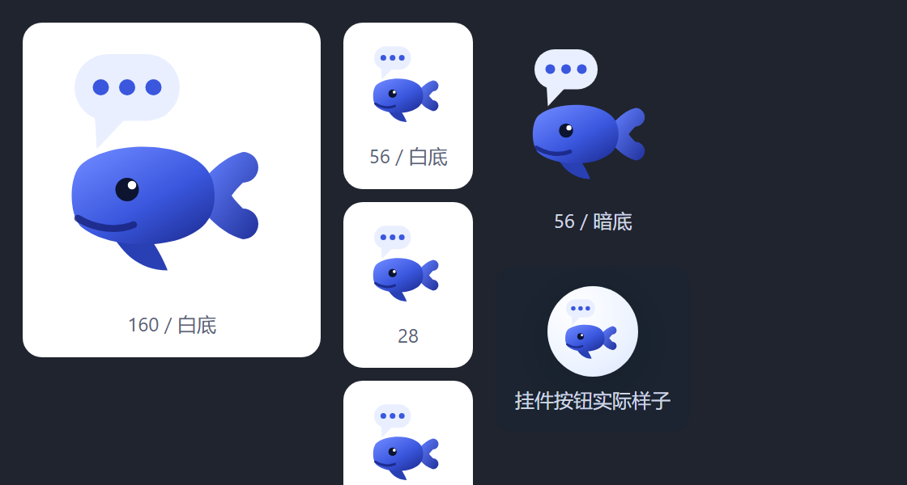

# DSH 补充提示挂件 / DSH Supplement Widget

给 DSH 挂一只会传话的小鲸鱼——任务跑得正欢，点一下挂件就能补充提示，不打断、不等候。

Give DSH a messenger whale — while a long task is running, click the whale to slip in an extra instruction. No interruption, no waiting.

本目录是本仓库的 **DSH（DeepSeek Harness）宿主实现**。它把桌面悬浮窗换成了 DSH 对话界面里常驻的挂件，把外部钩子进程换成了进程内的原生 cordis 插件：不依赖 Python，不写状态文件，没有额外的常驻进程。三个宿主（WorkBuddy / ZCode / DSH）共享同一套交互与文案约定，完整对照表见[仓库根 README](../README.md)。

This directory is the **DSH (DeepSeek Harness) host implementation** of this repository. The desktop overlay becomes a widget that lives in the DSH conversation window, and the external hook processes become a native in-process cordis plugin: no Python, no state files, no extra resident process. All three hosts (WorkBuddy / ZCode / DSH) share one interaction and copy contract — see the [repository README](../README.md) for the full comparison.



## 与其它宿主的关键差别 / Key differences from the other hosts

| | WorkBuddy 版 | ZCode 版 | **DSH 版（本目录）** |
| --- | --- | --- | --- |
| 挂件形态 | PySide6 桌面悬浮窗 | PySide6 桌面悬浮窗 | **对话界面内常驻挂件**（原生 DOM） |
| 接入方式 | 4 个外部钩子进程 | 5 个外部钩子进程 | **进程内 cordis 插件** |
| 点击 → AI | 写 pending 文件，钩子消费 | 写 pending 文件，钩子消费 | **本地回环 HTTP 路由 → 进程内状态机** |
| 运行时依赖 | Python + PySide6 | Python + PySide6 | **无** |
| 兜底手段 | Stop 钩子阻止收尾 | PreToolUse 拒绝其它工具 | `agent/turn-stopping` 让回合再走一步 |

| | WorkBuddy | ZCode | **DSH (this directory)** |
| --- | --- | --- | --- |
| Widget | PySide6 desktop overlay | PySide6 desktop overlay | **Resident in-page widget** (plain DOM) |
| Wiring | 4 external hook processes | 5 external hook processes | **In-process cordis plugin** |
| Click → AI | writes a pending file | writes a pending file | **loopback HTTP route → in-process state machine** |
| Runtime deps | Python + PySide6 | Python + PySide6 | **none** |
| Fallback | the Stop hook blocks the stop | PreToolUse denies other tools | `agent/turn-stopping` forces one more step |

## 安装 / Install

前置只有 DSH 本身（Node.js 随 DSH 一起装好）。

The only prerequisite is DSH itself (Node.js ships with it).

```bash
git clone https://github.com/Elysia-laoda/whale-whisper.git
cd whale-whisper
node dsh/scripts/install.mjs          # 装进 $DSH_PROFILE（默认 desktop）
```

装完 **完全退出并重开 DSH**，对话窗口右下角就会出现小鲸鱼。

**Quit DSH completely and start it again**; the whale appears at the bottom-right of the conversation window.

安装脚本只做两件事，每个被改动的文件都先备份成 `.bak-<时间戳>`：

1. 把包复制到 `<DSH_HOME>/profiles/<profile>/node_modules/dsh-whisper-whale`；
2. 把 `dsh-whisper-whale` 追加进该档案 `package.json` 的 `dsh.profile.bundles`。

The installer does exactly two things, backing up every file it touches to `.bak-<timestamp>`:

1. copies the package into `<DSH_HOME>/profiles/<profile>/node_modules/dsh-whisper-whale`;
2. appends `dsh-whisper-whale` to that profile's `dsh.profile.bundles` in `package.json`.

> **为什么不改 `cordis.yml`？** DSH 每次启动都会重新生成 `<profile>/cordis.yml`（文件里就写着 "Edit cordis.patch.yml, not this file"）。真正的输入顺序是 `bundles` → `cordis.patch.yml` → `$DSH_HOME/cordis.patch.yml` → `--patch`。本包的 `cordis.patch.yml` 会插入一行 loader entry，所以进 bundles 就够了——安装不会被下次启动覆盖，也不需要动用户自己的 patch 文件。

> **Why not edit `cordis.yml`?** DSH regenerates `<profile>/cordis.yml` on every launch (the file itself says "Edit cordis.patch.yml, not this file"). The real input order is `bundles` → `cordis.patch.yml` → `$DSH_HOME/cordis.patch.yml` → `--patch`. This package's `cordis.patch.yml` inserts one loader entry, so being in `bundles` is enough — the install survives the next launch and never touches the user's own patch file.

```bash
node dsh/scripts/install.mjs --profile web       # 装进别的档案 / another profile
node dsh/scripts/install.mjs --home D:\dshhome    # 指定 DSH_HOME / another DSH_HOME
node dsh/scripts/install.mjs --link              # 软链而不是复制 / symlink instead of copy
node dsh/scripts/install.mjs --dry-run           # 只说不做 / plan only
node dsh/scripts/uninstall.mjs                   # 卸载，参数相同 / uninstall, same flags
```

> 在档案目录里跑过 `pnpm install` 之后，pnpm 可能会剪掉不在 lockfile 里的包目录——重跑一次安装即可。

> After a `pnpm install` inside the profile directory, pnpm may prune packages missing from its lockfile — just run the installer again.

## 用法 / Usage

| 你做什么 / You do | 发生什么 / What happens |
| --- | --- |
| 平时 | 小鲸鱼常驻对话窗口右下角；拖到顺手的位置，位置自动记住 |
| 任务运行中**点一下** | 只有一个对话在跑 → 直接派发；多个 → 弹出清单由你点选；一个都没有 → 气泡提示 |
| 派发成功 | 气泡依次显示「已通知 AI ✓」→「它马上就抽空来问你」 |
| 几秒内 | AI 调用 `ask_user_question` 问「有什么要补充的吗？」→ 你自由输入 |
| 补充之后 | AI 用一句话说明据此调整了什么，带着补充继续原任务 |
| **右键** | 点我提问 / 重置位置 / 本对话不再理会挂件 / 隐藏小鲸鱼 / 关于 |
| **双击** | 藏起小鲸鱼，右下角留一个圆点，点一下回来 |
| 不想要了 | 说一句「关掉挂件」，本会话立刻闭嘴 |

| You do | What happens |
| --- | --- |
| Idle | the whale sits at the bottom-right; drag it anywhere and the position is remembered |
| **Click** while a task runs | one running conversation → dispatched directly; several → a picker list; none → a hint bubble |
| Dispatched | the bubble walks through "已通知 AI ✓" → "它马上就抽空来问你" |
| Within seconds | the AI calls `ask_user_question` with "有什么要补充的吗？" → you answer in free text |
| After answering | the AI states in one line what it adjusted, then continues the original task |
| **Right-click** | ask now / reset position / mute this conversation / hide the whale / about |
| **Double-click** | hides the whale and leaves a dot in the corner; click the dot to bring it back |
| Done with it | say "关掉挂件" and this conversation stops handling widget events |

挂件位置存在浏览器 localStorage（按原点保存，缩放窗口不会跑丢）。控制台里还有 `window.__whisperWhale`（`show() / hide() / reset() / hint(text)`）可以微调。

The widget position lives in browser localStorage, anchored so resizing the window cannot lose it. `window.__whisperWhale` (`show() / hide() / reset() / hint(text)`) is available in the console for tweaks.


## 原理 / How it works

```
点击右下角小鲸鱼 🐋
   │  浏览器半（lib/client.js）先看有几个「正在工作中」的对话：0 / 1 / 多个
   │  POST /whisper-whale/click  { sessionId? }
   ▼
宿主半（lib/index.js）在进程内登记一个待处理事件
   │  唯一 id（w-xxxx-xxx）+ 15 分钟有效期；同一会话只保留最新一个
   ▼
三个拦截点，谁先到谁投递；投递一次即标记 delivered，重复不再打扰：
   · agent/pre-step      用户发言时 → 提醒合并进这一步的入参消息末尾
   · tools/post-execute  工具跑完时 → 提醒挂成 additionalContexts（任务运行中的主路径）
   · agent/turn-stopping 回合要结束了还没投出去 → agent.steer() 再走一步，先把问题问了
   ▼
AI 调用 ask_user_question：「有什么要补充的吗？」
   │  会话开头（agent/created）已经注入过一次「挂件是什么、收到事件怎么办」
   ▼
你回答 → AI 把补充纳入计划，继续干活
```

```
click the whale at the bottom-right 🐋
   │  the browser half (lib/client.js) first counts "running" conversations: 0 / 1 / many
   │  POST /whisper-whale/click  { sessionId? }
   ▼
the host half (lib/index.js) records a pending event in-process
   │  unique id (w-xxxx-xxx), 15-minute TTL, at most one event per conversation
   ▼
three interception points; the first one to fire delivers it, once:
   · agent/pre-step      on a user prompt  → the reminder joins this step's input messages
   · tools/post-execute  after a tool call → the reminder becomes an additionalContext (the main path)
   · agent/turn-stopping when the turn is about to end → agent.steer() forces one more step
   ▼
the AI calls ask_user_question: "有什么要补充的吗？"
   │  the session-start context (agent/created) already explained the widget and the event contract
   ▼
you answer → the AI folds it into the plan and keeps working
```

**不会硬中断。** AI 会让「当前正在执行的单个工具」跑完，在下一个动作边界才提问——这正是挂件相对「强行打断」的价值。

**Nothing is hard-interrupted.** The AI lets the single tool call in flight finish and asks at the next action boundary — that is the whole point of the widget versus interrupting the run.

## 目标会话怎么判定 / How the target conversation is chosen

只列 `ctx.agents.list()` 里 `status === 'running'` 的**顶层**对话。子代理在跑只是父对话回合里的一步，不会单独出现在清单里；历史对话与已完成的对话也不会列出来，所以清单不会随对话数量变臃肿。一个在跑的都没有时不会瞎猜目标。

Only **top-level** conversations whose `ctx.agents.list()` entry reports `status === 'running'` are listed. A running subagent is a step of its parent's turn and never appears as its own row; finished and historical conversations are excluded too, so the picker does not grow with conversation count. When nothing is running the widget refuses to guess.

## 状态放在哪 / Where the state lives

**没有状态目录。** 事件表、每会话的静默标记、开头上下文是否已注入，全部活在 DSH 进程内存里，进程重启即清空——这正是想要的：重启之后不该再冒出一个十分钟前的旧提醒。

**There is no state directory.** The event table, per-conversation mute flags and the "greeting already injected" marker all live in DSH process memory and are cleared on restart — which is the intent: a stale reminder from ten minutes ago should not surface after a restart.

## 验证清单 / Verification checklist

1. 重开 DSH → 对话窗口右下角出现小鲸鱼，拖动后刷新页面位置还在；
2. 随便让 AI 干个多步的活（例如「依次跑 3 条 pwsh 命令」）；
3. 跑的过程中点一下小鲸鱼 → 气泡显示「已通知 AI ✓」；
4. 几秒内弹出提问卡片「有什么要补充的吗？」；
5. 输入「补充：xxx」→ AI 把 xxx 纳入计划继续；
6. 说一句「关掉挂件」→ 之后点小鲸鱼会提示「这个对话的挂件已经关了」。

1. Restart DSH → the whale appears at the bottom-right; drag it, reload the page, and the position persists.
2. Give the AI a multi-step job (for example "run three pwsh commands one after another").
3. Click the whale while it runs → the bubble shows "已通知 AI ✓".
4. Within seconds the question card appears: "有什么要补充的吗？".
5. Type "补充：xxx" → the AI folds xxx into the plan and continues.
6. Say "关掉挂件" → clicking the whale afterwards reports that this conversation has muted it.

## 与其它插件协作 / Driving it from other plugins

宿主半通过 `ctx.provide('whisperWhale', …)` 暴露了一份能力，快捷键插件、托盘启动器、自动化脚本都能直接用：

The host half exposes `ctx.provide('whisperWhale', …)`, so hotkey plugins, tray launchers and automation scripts can drive the widget directly:

```js
export const inject = [];            // 或写成 inject: ['whisperWhale']

export function apply(ctx) {
  // 读服务要用 ctx.get()：没写进 inject 时直接读 ctx.whisperWhale 会被 cordis 拒绝
  const whale = ctx.get('whisperWhale');

  whale.targets();                   // [{ id, title, cwd }] 正在工作中的顶层对话
  whale.click();                     // 自动选（唯一在跑的那个）
  whale.click(sessionId);            // 定向派发 → { ok, eventId, target, targets } | { ok:false, reason }
  whale.status(sessionId);           // { phase: 'idle'|'queued'|'delivered', eventId, dismissed, … }
  whale.mute(sessionId);             // 本会话不再理会挂件（并给模型一句说明）
  whale.mute(sessionId, false);      // 重新打开
}
```

HTTP 路由与它是同一份实现：

The HTTP routes share that exact implementation:

| 方法 | 路径 | 作用 |
| --- | --- | --- |
| GET | `/whisper-whale/targets` | 正在工作中的对话清单 / running conversations |
| GET | `/whisper-whale/state?sessionId=` | 某会话的挂件状态（气泡轮询用）/ widget state for one conversation |
| POST | `/whisper-whale/click` | `{ sessionId? }` 派发一次点击 / dispatch one click |
| POST | `/whisper-whale/mute` | `{ sessionId, muted }` 开/关 / mute or unmute |

四条路由都**只接受回环地址**（`127.0.0.1` / `::1`）的请求，非回环一律 403；请求体上限 64 KiB。

All four routes accept **loopback callers only** (`127.0.0.1` / `::1`) and answer 403 otherwise; request bodies are capped at 64 KiB.

## 开发与自测 / Development and self-test

```bash
cd dsh
npm install          # 只为 jsdom（开发依赖），插件本身零运行时依赖
npm test             # 46 个用例：状态机 / 文案 / 宿主拦截 / 浏览器 DOM
npm run check        # 语法检查
```

| 想改什么 | 改哪儿 |
| --- | --- |
| 注入文案、提问话术、气泡文案 | `lib/copy.js`（纯数据 + 纯函数） |
| 事件有效期、去重、静默逻辑 | `lib/whale-state.js`（纯状态机，无 IO） |
| 拦截时机、路由、服务 | `lib/index.js` |
| 小鲸鱼图标 | `icon.svg` 与 `lib/client.js` 里的 `WHALE_SVG` —— 同一份几何，两边一起改 |
| 挂件外观、拖动、气泡、菜单 | `lib/client.js`（自带 CSS，改完刷新页面即生效，无需构建） |

客户端没有构建步骤：`lib/client.js` 就是最终产物，形状与 dsh-client-modules 期望的懒加载 CJS 一致。

There is no client build step: `lib/client.js` is the shipped artifact, in the lazy-CJS shape dsh-client-modules expects.

### 端到端自测 / End-to-end self-test

`e2e/run.mjs` 会在**真实的 DSH 运行时与真实的 agent 循环**里验证四条投递链（会话开头上下文、`agent/pre-step`、`tools/post-execute`、`agent/turn-stopping`）。运行时需要先从安装包里解出来：

`e2e/run.mjs` verifies all four delivery paths (session-start context, `agent/pre-step`, `tools/post-execute`, `agent/turn-stopping`) against a **real DSH runtime and a real agent loop**. The runtime has to be extracted from the installed app first:

```bash
node e2e/extract-runtime.mjs --asar "D:/DSH/resources/app.asar" --out ./.runtime
node e2e/run.mjs --runtime ./.runtime --home ./_e2ehome
```

`e2e/widget-preview.mjs` 则把**真实的浏览器半**渲染成 PNG：

`e2e/widget-preview.mjs` renders the **real browser half** to a PNG:

```bash
node e2e/widget-preview.mjs                 # 深色主题 / dark theme
node e2e/widget-preview.mjs --theme light   # 浅色主题 / light theme
```

> 改挂件 CSS 之后请务必跑一次并**真的看图**。`npm test` 只验结构（元素在不在、文案对不对），看不到布局——上线过程中有两个缺陷就是这样漏过 46 个用例、被截图抓出来的：气泡在 56px 容器里绝对定位会收缩成一个字宽的竖条，以及主题探测只认 `document.body` 背景导致浅色主题永远误判。

> After touching widget CSS, run it and **actually look at the image**. `npm test` only checks structure (elements present, copy correct) and cannot see layout — two defects slipped past all 46 cases that way and were caught only by the screenshot: a bubble shrink-wrapped to one character wide inside the 56px container, and theme detection that only read `document.body`'s background.

## FAQ

**Q：点了小鲸鱼，AI 没反应？**
注入发生在「下一个工具调用之后」或「你下一次发言时」。如果 AI 正在跑一个很长的单步工具（比如几分钟的命令），它会在这一步结束后立刻提问——这是设计如此。如果 AI 全程空闲，点击会等到你下次发消息时补问。事件 15 分钟内有效，超时自动作废。气泡说「挂件没接上 DSH 宿主」= 宿主半没装载，检查插件是否启用、DSH 是否重启过。

**Q：同时开多个任务，点挂件会去哪个？**
只有一个在跑就直接派发；多个会弹出清单（标题 + 工作目录）由你点选，请求精确锁定该对话，其它任务不会抢答。

**Q：会打断 AI 正在跑的工具吗？**
不会。见上文「不会硬中断」。

**Q：在 TUI / headless 档案里能用吗？**
插件会正常装载（注入逻辑在线、`ctx.whisperWhale` 可用），只是没有浏览器挂件可点——小鲸鱼本来就是 Web GUI 的东西。装的时候不会因此报错，也不会让插件停在 "did not activate" 状态。

**Q：跟 DSH 版本升级会不会打架？**
本包**不 import 任何 `@deepseek-ai/*`**，只依赖 cordis 的 `ctx.on / ctx.inject / ctx.provide / ctx.effect` 与 harness 的四个扩展点；注入用的消息对象是按 `createUserMessage` 的形状自己造的，因此不存在 peer 版本门槛。真出问题也不影响会话：任何拦截点里出错都只记一条 warning 然后放行。

**Q：怎么彻底关掉？**
`node dsh/scripts/uninstall.mjs` 然后重启 DSH。只想静一静的话，右键 →「隐藏小鲸鱼」，或者直接说「关掉挂件」。

**Q: I clicked but the AI did not react.**
Delivery happens after the next tool call or on your next message. A long single-step tool (a command taking minutes) finishes first — that is by design. If the AI is completely idle, the click waits for your next message. An event is valid for 15 minutes and then expires. A bubble saying the widget is not connected to the DSH host means the host half is not loaded: check that the plugin is enabled and that DSH was restarted.

**Q: Several tasks are running — which one gets it?**
One running conversation is dispatched directly; several bring up a picker (title + working directory) and the request is pinned to your choice, so nothing else answers for it.

**Q: Does it interrupt the tool the AI is running?**
No. See "Nothing is hard-interrupted" above.

**Q: Does it work in a TUI or headless profile?**
The plugin still loads (the injection logic is live and `ctx.whisperWhale` is available); there is simply no browser widget to click, because the whale belongs to the Web GUI. It never errors or leaves the plugin stuck in a "did not activate" state.

**Q: Will a DSH upgrade break it?**
The package imports **no `@deepseek-ai/*`** at all — only cordis's `ctx.on / ctx.inject / ctx.provide / ctx.effect` and four harness extension points; the injected message object is built to the shape of `createUserMessage`. There is no peer-version gate to fight. And nothing it does can break a session: every failure inside an interception point is logged as a warning and the run proceeds.

**Q: How do I remove it completely?**
`node dsh/scripts/uninstall.mjs`, then restart DSH. To just quiet it down, right-click → "隐藏小鲸鱼", or say "关掉挂件".

## 图标 / Icon

小鲸鱼是本宿主**手绘的原创矢量**：钝头钝尾的体型、两片圆头尾鳍（外沿是真的圆弧）、后掠胸鳍，头顶一只三点气泡表示"它在问你"。它与 WorkBuddy / ZCode 版那只鲸鱼没有共用任何路径数据。

The whale is an **original hand-drawn vector** for this host: a blunt head and tail stock, two round-tipped flukes (real circular arcs on the outer edge) and a swept pectoral fin, with a three-dot speech bubble above the head meaning "it is asking you". It shares no path data with the whale used by the WorkBuddy and ZCode editions.

`icon.svg` 是独立文件（设置页插件列表用），`lib/client.js` 的 `WHALE_SVG` 是同一份几何；改的时候两边一起改。

`icon.svg` is the standalone file (used by the plugin list in Settings) and `WHALE_SVG` in `lib/client.js` is the same geometry — change both together.

## 许可 / License

MIT，与仓库根目录的 [LICENSE](../LICENSE) 相同。本目录不再单独放一份 LICENSE：整个仓库同一版权人、同一许可，重复一份只会造成版权归属不同的假象。

MIT, identical to the repository's root [LICENSE](../LICENSE). This directory deliberately carries no separate LICENSE file: the whole repository is one copyright holder under one license, and a duplicate would only suggest a different provenance.
